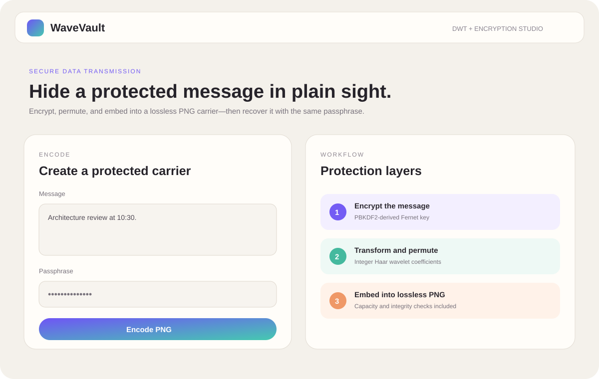
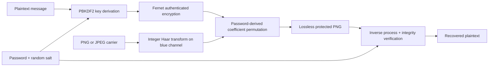

# WaveVault — Secure Data Transmission with Reversible DWT

[](https://github.com/nityaroshinikandula4/secure-data-transmission-dwt/actions/workflows/ci.yml)


A working portfolio implementation that combines authenticated encryption, reversible integer Haar wavelets, and password-derived coefficient permutation to hide a message in a lossless PNG carrier.



> **Boundary:** this is an educational steganography project. It does not replace audited encryption, secure transport, managed key storage, or formal security review.

## What is implemented

- Exact reversible 2×2 integer Haar transform—no floating-point coefficient drift
- PBKDF2-HMAC-SHA256 password derivation with a random salt
- Fernet authenticated encryption for confidentiality and integrity checks
- Stable coefficient groups that encode bits in high-frequency parity residues
- Password-derived permutation of payload coefficient positions
- FastAPI encode/decode endpoints with upload and message limits
- Responsive browser studio with an automatically generated safe carrier image
- Unit and API tests plus GitHub Actions CI

## Data flow



## Run locally

```bash
python -m venv .venv
source .venv/bin/activate            # Windows: .venv\Scripts\activate
pip install -r requirements.txt
uvicorn app.main:app --reload
```

Open `http://127.0.0.1:8000`. API documentation is available at `/docs`.

## API examples

Encode:

```bash
curl -X POST http://127.0.0.1:8000/api/encode \
  -F 'image=@carrier.png' \
  -F 'message=Protected portfolio message' \
  -F 'password=correct-horse-battery' \
  --output wavevault-protected.png
```

Decode:

```bash
curl -X POST http://127.0.0.1:8000/api/decode \
  -F 'image=@wavevault-protected.png' \
  -F 'password=correct-horse-battery'
```

## Why the output must remain PNG

The encoder reconstructs exact 8-bit pixels and writes a lossless PNG. JPEG compression, resizing, color correction, social-media upload processing, or image editing can change the wavelet coefficients and destroy the payload.

## Security notes

- Passwords must contain at least eight characters; production policy should be stronger and rate-limited.
- The fixed header exposes only format metadata, a random salt, and encrypted-token length—not the plaintext.
- Payload positions are permuted, but coefficient permutation is not a substitute for encryption.
- Metadata and file size can still reveal that an image changed; steganography does not guarantee undetectability.
- Production systems require authenticated users, secure key management, malware scanning, audit logging, and threat modeling.

## Testing

```bash
pytest -q
```

## Author

**Nitya Roshini Kandula** — Java Full Stack Developer with experience in secure workflows, REST APIs, relational data, testing, debugging, and technical documentation.

[LinkedIn](https://www.linkedin.com/in/nitya-roshini-kandula-a44335283/) · [GitHub](https://github.com/nityaroshinikandula4)
